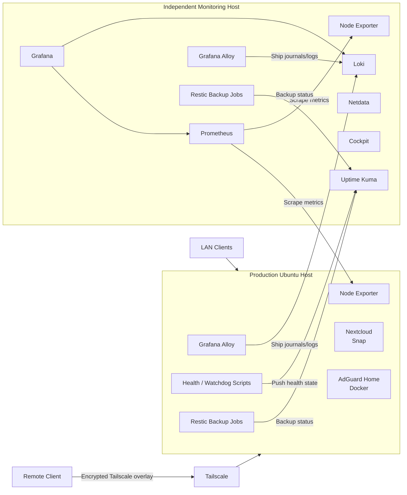

# Secure Homelab Infrastructure & Observability Platform

A security-conscious two-host homelab designed to demonstrate practical Linux systems administration, containerized services, private remote access, centralized observability, automated backups, health monitoring, and operational troubleshooting.

> **Portfolio note:** All addressing, hostnames, identifiers, URLs, tokens, and environment-specific values in this repository are sanitized or represented with placeholders. No credentials, private keys, Tailscale identities, push tokens, or production secrets are included.

## Project Goals

- Run self-hosted infrastructure without exposing management services directly to the public Internet.
- Provide network-wide DNS filtering with AdGuard Home.
- Extend DNS filtering securely to remote devices through Tailscale.
- Host private cloud services while maintaining clear service separation and recoverability.
- Centralize metrics, logs, service availability, and host health.
- Automate backups, retention, integrity checks, and backup-health reporting.
- Build repeatable systemd-based health checks and recovery workflows.

## Architecture



The design intentionally separates the **production/application host** from the **monitoring host**, so loss of an application service does not automatically remove visibility into the failure.

## Core Components

| Area | Technology | Purpose |
|---|---|---|
| Operating system | Ubuntu Linux | Server platform and service management |
| Containers | Docker / Docker Compose | Isolated application deployment |
| DNS filtering | AdGuard Home | Network-wide filtering and DNS control |
| Private remote access | Tailscale | Encrypted remote connectivity without public port forwarding |
| Private cloud | Nextcloud | Self-hosted file/application service |
| Availability | Uptime Kuma | Endpoint, DNS, and custom push monitoring |
| Metrics | Prometheus + Node Exporter | Host and service metrics collection |
| Dashboards | Grafana | Infrastructure visualization |
| Logs | Loki + Grafana Alloy | Centralized journal/log collection |
| Performance | Netdata | Real-time host performance visibility |
| Administration | Cockpit | Linux administrative interface |
| Backups | Restic | Deduplicated snapshots, retention, and repository verification |
| Automation | systemd services/timers | Scheduled health checks, metrics and backup jobs |

## Remote AdGuard DNS over Tailscale

Remote devices can use the AdGuard server as a DNS resolver without publishing DNS to the Internet.

Conceptually:

1. AdGuard publishes DNS on TCP/UDP 53 to interfaces that include the Tailscale path.
2. Tailscale provides the encrypted device-to-device network.
3. The tailnet DNS configuration points clients to the server's Tailscale address.
4. Remote clients accept Tailscale DNS settings.
5. Firewall rules allow DNS on the Tailscale interface while avoiding Internet-facing port forwarding.

An **exit node is not required for DNS filtering alone**. It is only needed when all client Internet traffic should egress through the home network.

See [`docs/REMOTE-DNS.md`](docs/REMOTE-DNS.md).

## Monitoring & Observability

The monitoring host provides multiple layers of visibility:

- **Uptime Kuma**: service reachability and custom push-health state.
- **Prometheus**: host metrics and custom textfile metrics.
- **Grafana**: consolidated infrastructure dashboards.
- **Loki + Alloy**: centralized logging from systemd journals and supported services.
- **Netdata**: rapid host-level troubleshooting and performance inspection.
- **Cockpit**: administrative service/process/log visibility.

This layered design avoids depending on only one signal to determine whether an application is healthy.

## Automated Backup Design

Backups use Restic repositories on dedicated mounted storage. The workflow includes:

- automated snapshots;
- service-aware handling where application consistency requires it;
- retention policy enforcement;
- repository integrity checks;
- last-success status recording;
- mount validation;
- snapshot age validation;
- free-space thresholds; and
- Uptime Kuma push-health reporting.

A verified monitoring-host backup run completed successfully, applied a 30-day retention policy, and completed a Restic repository integrity check without errors. The separate backup-health service also reported the repository, mount, and available capacity as healthy. See [`docs/BACKUP-STRATEGY.md`](docs/BACKUP-STRATEGY.md).

## Automation Examples

This repository includes sanitized examples of:

- AdGuard/Tailscale diagnostic and recovery tooling;
- backup-health monitoring;
- system-wide health reporting;
- systemd one-shot services and recurring timers;
- environment-file handling for push URLs/secrets; and
- Docker Compose configuration patterns.

See [`scripts/`](scripts/) and [`systemd/`](systemd/).

## Troubleshooting Case Study

During the build, the production system-health service remained healthy while an independent backup-health unit repeatedly returned an exit status. That separation was useful: it showed the host and applications were healthy while isolating the fault to the backup-reporting path rather than treating the entire server as down.

The monitoring-host backup path was independently validated through successful Restic snapshots, retention, integrity checks, and repeated backup-health reports. This is documented as an operational troubleshooting case rather than hidden from the project history.

See [`docs/TROUBLESHOOTING.md`](docs/TROUBLESHOOTING.md).

## Security Design Principles

- No public exposure of DNS or management dashboards.
- Remote administration through Tailscale rather than router port forwarding.
- Management and monitoring traffic restricted to trusted LAN/Tailscale paths.
- Secrets stored outside scripts in root-readable environment files.
- No Docker socket access granted to monitoring tools unless explicitly required.
- Dedicated backup mounts and health validation.
- Least-privilege and service isolation where practical.
- Sanitized diagnostics before sharing logs externally.

See [`SECURITY.md`](SECURITY.md).

## Repository Structure

```text
.
├── README.md
├── PORTFOLIO.md
├── SECURITY.md
├── docs/
│   ├── ARCHITECTURE.md
│   ├── BACKUP-STRATEGY.md
│   ├── REMOTE-DNS.md
│   ├── RUNBOOK.md
│   └── TROUBLESHOOTING.md
├── docker/
│   └── adguard-compose.example.yml
├── examples/
│   └── monitoring.env.example
├── scripts/
│   ├── adguard-tailscale-emergency-tool.sh
│   ├── backup-health.sh
│   └── system-health.sh
└── systemd/
    ├── backup-health.service
    ├── backup-health.timer
    ├── system-health.service
    └── system-health.timer
```

## Skills Demonstrated

- Linux server administration
- Docker and Docker Compose
- systemd services and timers
- DNS architecture and troubleshooting
- Tailscale / overlay networking
- Firewall and service exposure design
- Prometheus / Grafana observability
- Loki / Alloy centralized logging
- Uptime Kuma push monitoring
- Restic backup engineering
- Shell scripting and operational automation
- Incident isolation and root-cause troubleshooting
- Secure configuration and secret hygiene

## Status

This repository is a **sanitized portfolio representation** of a working homelab project. Example configuration files intentionally use documentation-only addresses and placeholder secrets and are not intended to be copied into production without review.
